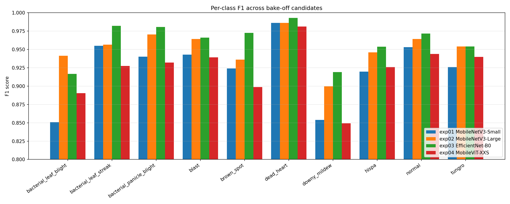
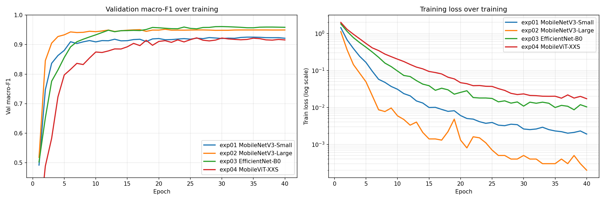

# Phase 1 — Bake-off Report

Four candidate models trained with **identical pipelines** (no augmentation,
no class weighting, AdamW + frozen-then-unfrozen schedule, 40 epochs, seed=42,
same 70/15/15 stratified Kaggle Paddy 2022 split). Only the model architecture
varies. Goal: select the best architecture for Phase 2 optimization.

## Headline metrics

| Exp | Model | Val macro-F1 | Val Acc | Top-2 | Top-3 | AUC-OvR | Params (M) | MACs (G) | Ckpt (MB) | CPU mean (ms) | CPU p95 (ms) | GPU mean (ms) | Peak VRAM (MB) | Train (min) | s/epoch |
|---|---|---|---|---|---|---|---|---|---|---|---|---|---|---|---|
| exp01 | MobileNetV3-Small | 0.9251 | 0.9347 | 0.9737 | 0.9865 | 0.9956 | 1.528 | 0.061 | 6.25 | 8.28 | 10.15 | 8.91 | 613.1 | 48.1 | 72.1 |
| exp02 | MobileNetV3-Large | 0.9518 | 0.9558 | 0.9814 | 0.9910 | 0.9971 | 4.215 | 0.234 | 17.07 | 15.54 | 18.17 | 9.86 | 1586.2 | 48.5 | 72.7 |
| exp03 ★ | EfficientNet-B0 | 0.9609 | 0.9641 | 0.9865 | 0.9936 | 0.9979 | 4.020 | 0.414 | 16.38 | 25.79 | 32.80 | 12.64 | 2977.0 | 51.2 | 76.7 |
| exp04 | MobileViT-XXS | 0.9227 | 0.9321 | 0.9705 | 0.9833 | 0.9936 | 0.954 | 0.257 | 3.96 | 21.57 | 26.96 | 13.56 | 1659.0 | 51.7 | 77.6 |

★ Highest val macro-F1: **EfficientNet-B0** (exp03) at 0.9609.

## Per-class F1

| Class | exp01 | exp02 | exp03 | exp04 |
|---|---|---|---|---|
| bacterial_leaf_blight | 0.8507 | 0.9412 | 0.9167 | 0.8904 |
| bacterial_leaf_streak | 0.9550 | 0.9565 | 0.9821 | 0.9273 |
| bacterial_panicle_blight | 0.9400 | 0.9703 | 0.9804 | 0.9320 |
| blast | 0.9430 | 0.9642 | 0.9659 | 0.9392 |
| brown_spot | 0.9241 | 0.9362 | 0.9724 | 0.8986 |
| dead_heart | 0.9860 | 0.9860 | 0.9930 | 0.9812 |
| downy_mildew | 0.8539 | 0.8995 | 0.9189 | 0.8492 |
| hispa | 0.9196 | 0.9458 | 0.9538 | 0.9260 |
| normal | 0.9529 | 0.9642 | 0.9716 | 0.9438 |
| tungro | 0.9258 | 0.9541 | 0.9541 | 0.9398 |



## Training dynamics



Observations on convergence and overfitting are documented in the discussion below.

## Production constraints (all candidates)

| Constraint | Budget | exp01 | exp02 | exp03 | exp04 |
|---|---|---|---|---|---|
| ONNX size  | < 50 MB | 6.2 | 17.1 | 16.4 | 4.0 |
| CPU latency (p95) | < 500 ms | 10.2 | 18.2 | 32.8 | 27.0 |
| Val macro-F1 | > 0.85 | 0.9251 | 0.9518 | 0.9609 | 0.9227 |

All four candidates meet every production constraint. The decision is which gives the best Phase 2 optimization headroom and final inference accuracy.

## Phase 2 candidate ranking

Sorted by val macro-F1 (descending):

1. **exp03 EfficientNet-B0** — macro-F1 0.9609, 25.79 ms CPU, 4.02 M params
2. **exp02 MobileNetV3-Large** — macro-F1 0.9518, 15.54 ms CPU, 4.21 M params
3. **exp01 MobileNetV3-Small** — macro-F1 0.9251, 8.28 ms CPU, 1.53 M params
4. **exp04 MobileViT-XXS** — macro-F1 0.9227, 21.57 ms CPU, 0.95 M params

## Reproduction

```bash
# Regenerate this report after any retrain:
python scripts/generate_bakeoff_report.py
```

Aggregated raw numbers: `results/phase1_metrics_combined.json`.
